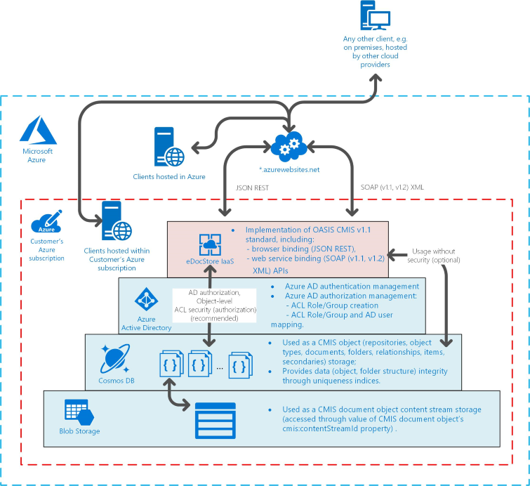

# Architecture overview of the eDocStore solution hosted on Microsoft Azure

The eDocStore is mainly written in .NET/C# and it has a 2-tier architecture model which consists of 
* Databases - stores data (metadata, binary). As a content metadata storage NoSQL database, particularly, CosmosDB is used. Content binary data is stored in the Azure Blob Storage; 
* Bindings - provides ECM grade read and write interoperability access to data stored in the databases via open standard (CMIS v1.1) protocols in a very secure manner where a federated security layer is provided by built-in integration with Azure Active Directory (AAD) services. Consumers of eDocStore binding services can be any software which can communicate through SOAP v1.1, v1.2 (XML) or HTTP (JSON) protocols with transport security enabled;
* Administrative Panel - provides abilities to create required database instances and structures, create and manage CMIS repositories, explore and manage any CMIS repository data, also provides license information. Administrative Panel does not depend on any particular binding. AAD federated authentication security is used to protect Administrative Panel.

  

### Provided security solution

Azure Active directory (AAD) is used to provide federated authentication and CMIS object-level Access Control List (ACL) authorization. CMIS object ACL principals are registered AAD application AppRoles or Users.  
For federated authorization for both bindings Oauth2 protocol with (JSON Web Token) JWT token and transport security are used.

It is possible but not recommended to disable CMIS object-level ACL authorization or AAD authentication completely for Binding applications individually.
It is possible but not recommended to disable AAD authentication for Administrative Panel.

## See also
- [Installation guide](edocstore-azure-installation-guide.md)
- [User guide](edocstore-azure-user-guide.md)
- [Samples](edocstore-azure-samples.md)
- [eDocStore overview](welcome.md)