<!--
---
title: "eDocStore installation guide (Microsoft Azure)"
description: eDocStore installation guide (Microsoft Azure).
date: 09/11/2018
---
-->
# eDocStore installation guide (Microsoft Azure)

This installation guide contains step by step instructions of how to:

* [deploy _eDocStore_ on _Microsoft Azure_](#deployment);
* [configure deployed _eDocStore_ applications](#inital-configuration).

## Deployment

This section describes step by step instructions of how to deploy eDocStore from Azure Marketplace.

The default eDocStore Azure resource deployment creates Azure resources which do not start to consume Azure credits right after deployment. By default the only non-free resource is CosmosDB, which consumes Azure credits only once it has created and existing collection.

To deploy eDocStore Azure resources:
1. Find the eDocStore in the Marketplace and click on __Create__.
2. In the _Basic_ step
 *  choose the __Subscription__ where to deploy the eDocStore resources,  
 *  create a new or use an existing but empty __Resource group__,  
 *  choose resource group __Location__,

 then click on __OK__.
 
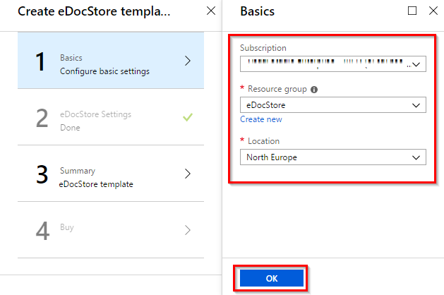    
3. In the succeeding step  
 *  choose the __Pricing Tier__ for the eDocStore binding _App service_ hosting, by default hosting plan is shared among all API service applications (bindings);
 *  choose the eDocStore API service applications (bindings) to be deployed, each binding (protocol) has it's own Azure _App service_ instance,  

 then click on __OK__.

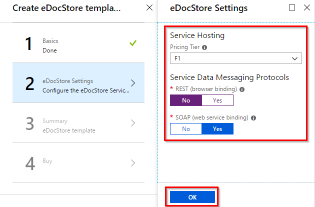    
4. In the _Summary_ step review your settings, then click on __OK__.
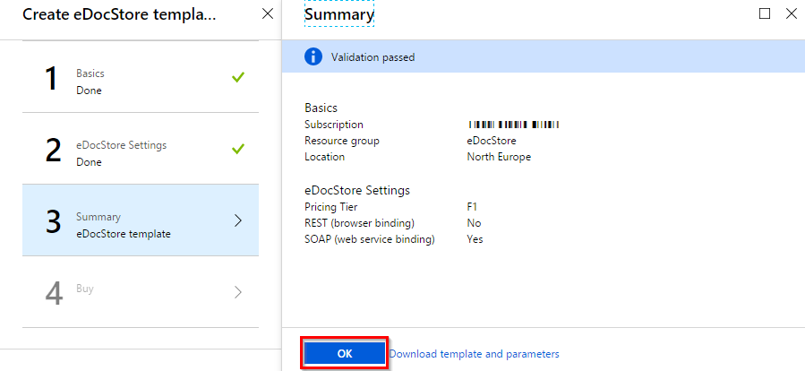    
5. In the _Buy_ step review and agree to the Microsoft's terms of use and on __Create__ to initialize eDocStore Azure resource creation. The creation takes 5-10 minutes.
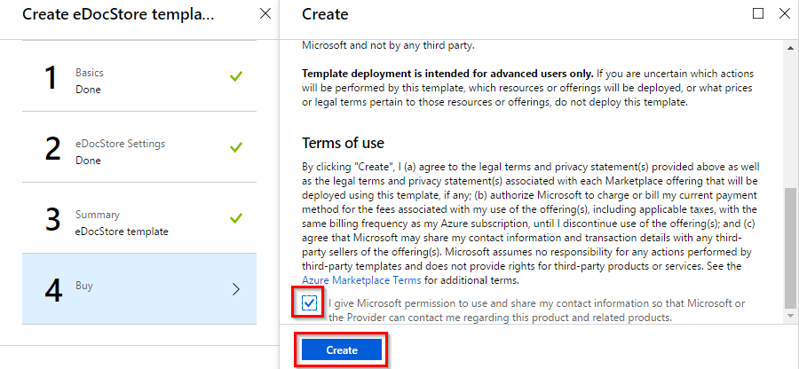    

## Inital configuration

After a successful deployment _eDocStore_ applications comes with initial security configuration which prohibits unauthorized access to eDocStore applications. To be able to use eDocStore applications after a deployment either security configuration is completed (recommended) or security is disabled.

This section contains step by step instructions of how to configure security for each of eDocStore applications (Administrative Panel, SOAP API service, REST API service):
* [setup _Azure AD_ authentications to _eDocStore_ _Administrative Panel_ application](#administrative-panel);
* [setup _Azure AD_ authentications and authorization to _Web service_ and _Browser_ binding services](#web-service-and-browser-bindings);
* [setup _Azure AD_ authentications and authorization to _Web service_ and _Browser_ binding client side applications](#web-service-and-browser-binding-clients) (_contains code samples_).

### Administrative Panel 

This section describes step by step instructions of how to setup _eDocStore Administrative Panel_ _Azure Active Directory_ authentication security in the __Azure Portal__.

1.  In the __Azure Portal__ _Azure Active Directory_ tenant where __eDocStore__ has been deployed in the __App Service__ pane select __Administrative Panel__ app (by default name starts with ‘_edocstoremngr.._’) click on __Authentication / Authorization__  
   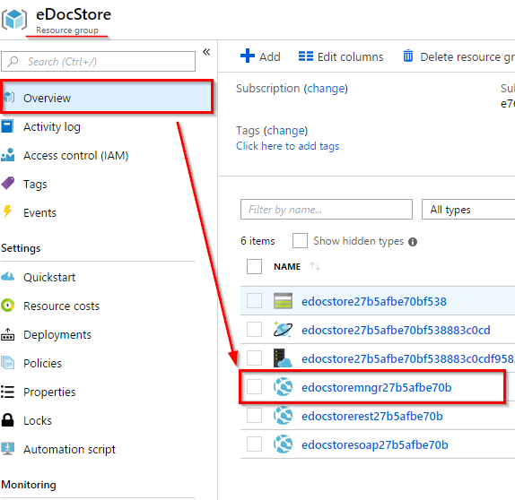    

   1.1.  verify that ‘__App Service Authentication__’ is ‘__On__’;  

   1.2.  verify that ‘__Action to take when request is not authenticated__’ is ‘__Log in with Azure Active Directory__’;  

   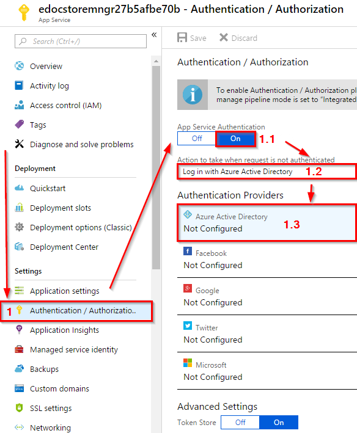    
      
   1.3.  as __Authentication Provider__ choose __Azure Active Directory__ and in the succeeding page select __Express__, then choose __Create New AD Application__ and click on __OK__. Then click on __Save__ and wait till _Azure AD_ application is being created.     
        
   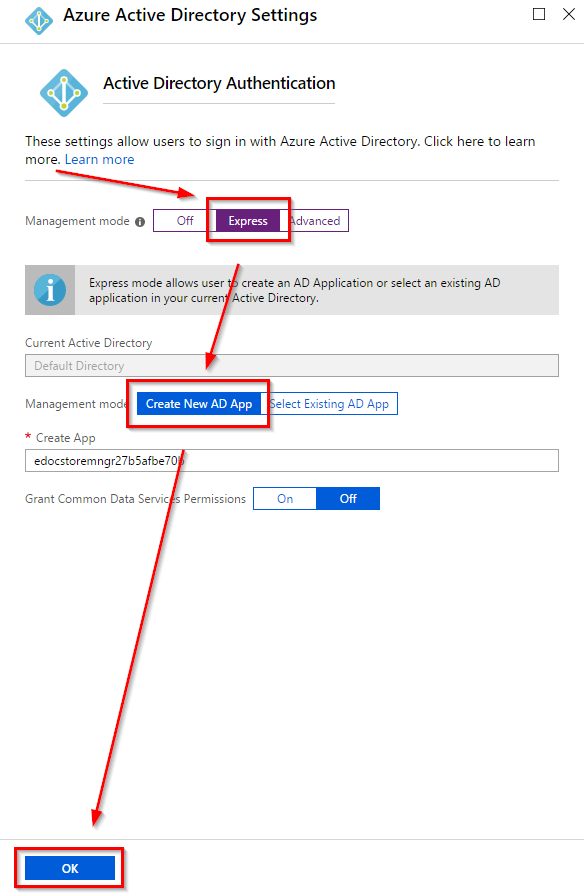  
   
   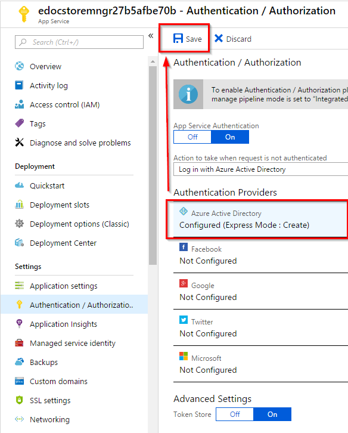  
   
2.	By default all users in specific _Azure AD_ tenant will be able to access the __Administrative Panel__ (after step #3 will be completed). To restrict access to the specific users of _Azure AD_ tenant __(*recommended*)__ continue with this step; otherwise proceed to the last step (#3).   
In the __Azure Active Directory__ pane click on __Enterprise Applications__ and select _Administrative Panel_ __Azure AD App__ (which was created in the step #1).
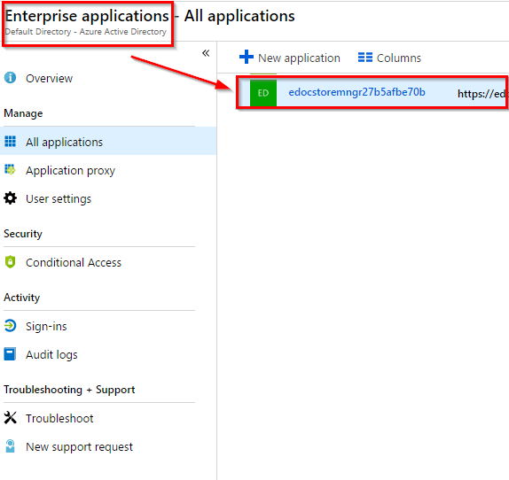  

    In the succeeding page	

	2.1.  click on __Properties__ and set ‘__User assignment required__’ to ‘__Yes__’ and click on __Save__. Now only the allowed _Azure AD_ tenant users will be able to access the __Administrative Panel__;
	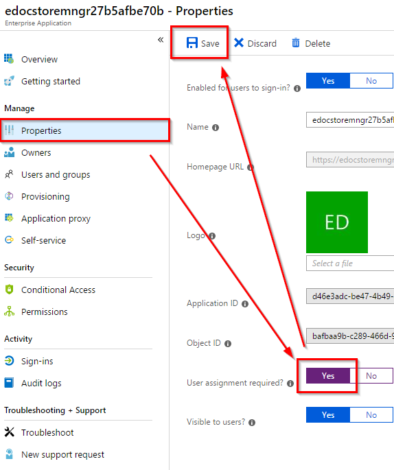  
	
	2.2.  to allow a specific user access to the __Administrative Panel__ click on __Users and groups__ and choose __Add user__. In the succeeding page select user which you want to be able to access the __Administrative Panel__ and click on __Assign__.
	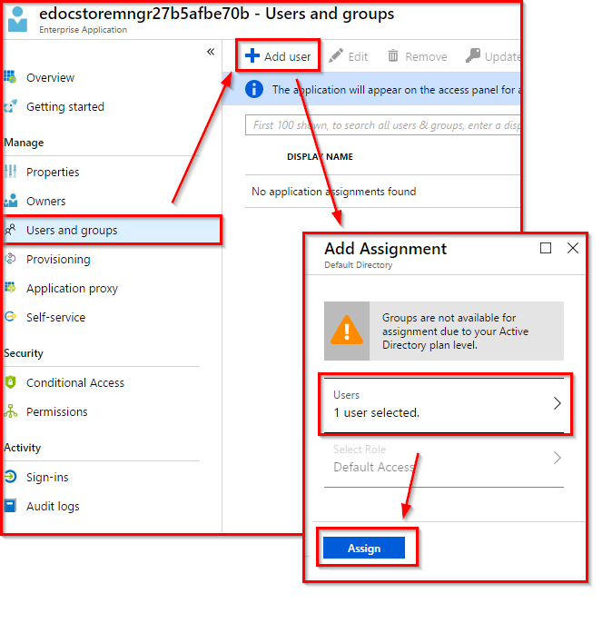  
	
3.	To complete security configuration and allow access to the __Administrative Panel__ to any user (or only allowed users in case if step #2 was completed) in the __Azure Active Directory__ pane click on __App Registrations__ and in the succeeding page select _Administrative Panel Azure AD App_ (which was created in the step #1). 
   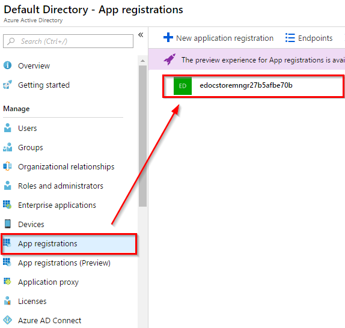  
   In the succeeding page click on __Settings__, then in the succeeding page click on __Required Permissions__ and in the succeeding page click on __Grant permissions__ to allow sign in with _Azure AD_ user credentials.
   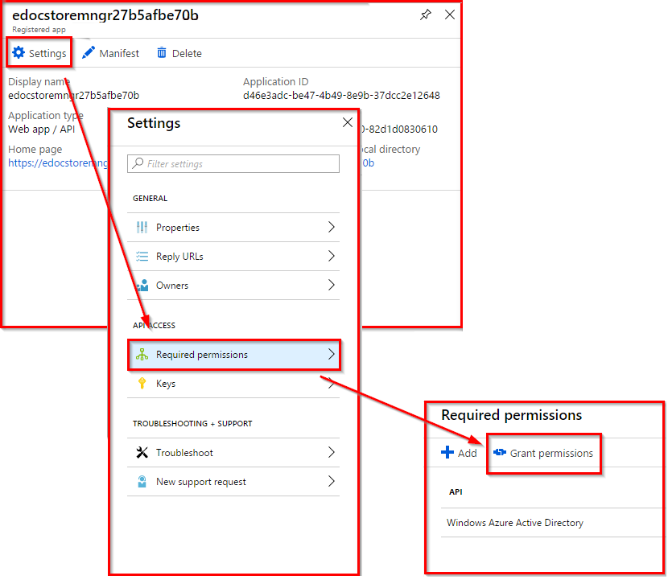  

### Web service and Browser bindings

This section contains step by step instructions of how to setup _eDocStore_ _Web service_ and _Browser binding_ service _Azure Active Directory_ authentication and _CMIS_ object _Access Control List_ (_ACL_) authorization security in the _Azure Portal_. These instructions applies to both available service bindings and created _Azure AD_ artifacts can be shared among them concurrently.

1.	In the __Azure Active Directory__ pane click on __App Registrations__ and choose __New application registration__.
	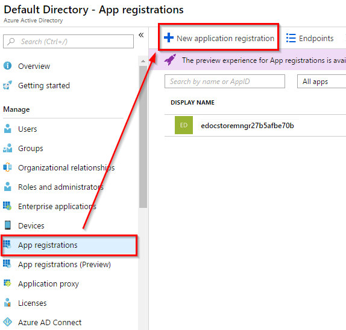  

	1.1.	Provide an application name, for example 'edocstore-services', select the ‘__Web app / API__’  as the _Application Type_, provide any value in __Sign-on URL__ as it won’t be used in this scenario and click on __Create__. 	
	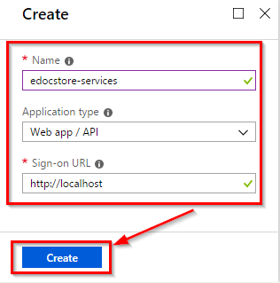  
	
	1.2.	In the succeeding page click on __Manifest__ and set _ACL_ roles which should be available for granting to _Azure AD_ users from __Azure Portal__. By convention all eDocStore _CMIS_ objects (except repositories – which can be accessed by any user which can access service) have _Access Control Entry_ for ‘__Administrator__’ (_case-sensitive_) role with ‘__cmis:all__’ permission. Therefore it is required to set ‘__Administrator__’ role in _Azure AD_ manifest __appRole collection__ to be able to access the root folder of the repository:
	
	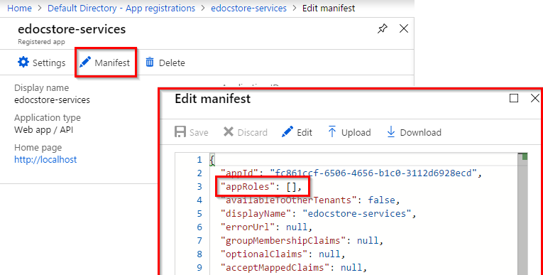  
	
	_AppRoles_ sample value:
	```
	"appRoles": [
	{
	    "allowedMemberTypes": [
	      "User"
	    ],
	    "displayName": "Administrator",
	    "id": "6f2a2c46-58ed-4e49-97e8-ba30a6d81d8b",
	    "isEnabled": true,
	    "description": "global administrator",
	    "value": "Administrator"
	},
	..
	{
	    // another role
	}]
	```		
	You will be able to update the __appRole collection__ as needed, but to start to successfully use eDocStore binding services it is __highly recommended__ to add this ‘__Administrator__’ role.
	
	__NB!__ users with ‘__Administrator__’ role will be able to do anything in any _CMIS_ repository with any _CMIS_ object; this role and it’s permission can not be removed from the _CMIS_ object _ACL_, therefore this role should be given to as few users as possible. It is __highly recommended__ to create local administrator roles for each CMIS repository individually. 
2. In the __App Service__ pane select eDocStore REST/SOAP API service __App Service__ and  click on __Application settings__	
2.1. Set __ida:IsEnabled__ property value to ‘__true__’ (_default_)
   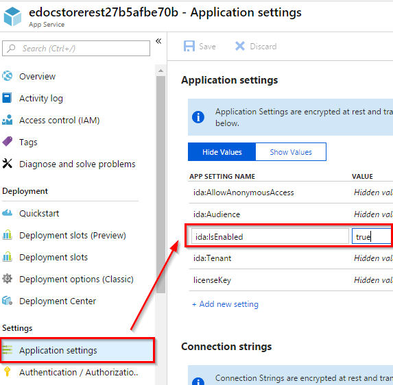  
2.2. Set __ida:Tenant__ property value to _Azure AD_ tenant name, which can be found in __Azure Active Directory__ pane -> __Overview__ page. 
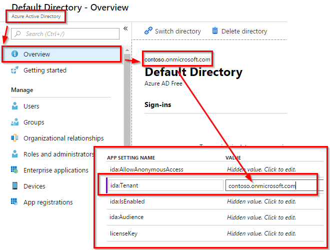  
2.3. Set __ida:Audience__ property value to _App Id URI_ of the 'edocstore-services' application (which was created in step #1). _App Id URI_ can be found in __Azure Active Directory__ pane -> __App registrations__ page -> 'edocstore-services' application -> __Settings__ page -> __Properties__ page -> __App ID URI__.
  
2.4. Click on __Save__.  	
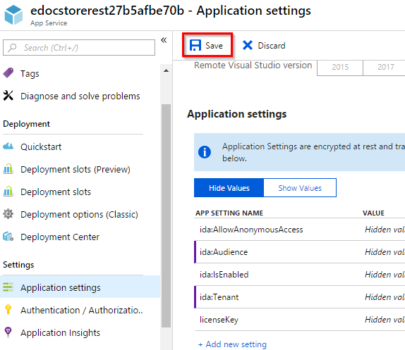     
3.	By default all users in specific _Azure AD_ tenant will be able to access the _eDocStore_ binding services (even if they won’t have assigned any roles they will be able to retrieve repository information via _GetRepositories_, _GetRepositoryInfo_ services). If you want to restrict access to the specific users of _Azure AD_ tenant __(*recommended*)__ continue with this step; otherwise proceed to the succeeding step.   
In the __Azure Active Directory__ pane click on __Enterprise Applications__ and select 'edocstore-services' application service principal. In the succeeding page 
      
	3.1.	 Click on __Properties__ and set ‘__User assignment required__’ to ‘__Yes__’, then Click on __Save__.  
	  	
	Now only the allowed _Azure AD_ tenant users will be able to access the services (including _GetRepositories_, _GetRepositoryInfo_ services).    
	
	3.2.	To allow a user access to the 'edocstore-services’ application click on __Users and groups__ and choose __Add user__. In the succeeding page select users which should be able to access the services and click on __Assign__.  
	  

4.	To assign roles to specific users in the __Azure Active Directory__ pane click on __Enterprise Applications__ and select 'edocstore-services' application (which was created in step #1) _service principal_ (i.e. _Enterprise Application_). In the succeeding page click on __Users and groups__ and choose __Add user__. In the succeeding page a select user or multiple users to assign specific single role (it is possible to assign multiple roles to the specific user, but for each role assignment the specific user need to be added repeatedly), then select the role and click on __Assign__.  
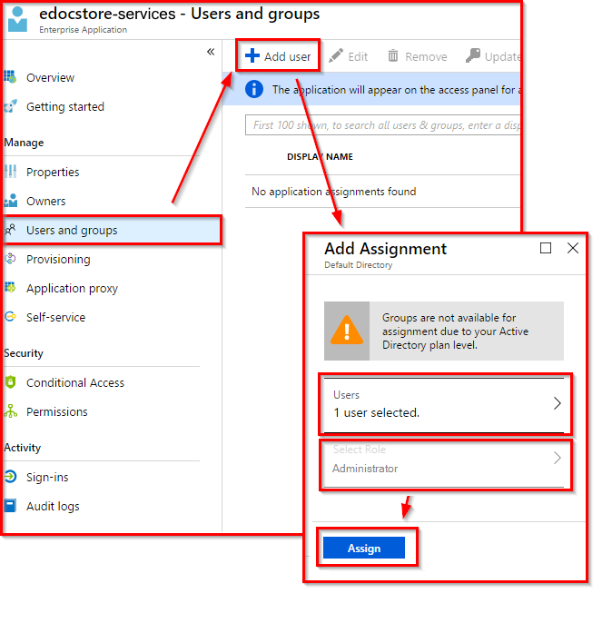  
__NB!__ To be able to Add role, it must be added to the __Application Manifest__ which was described in step #1.2.

#### Web service and Browser binding clients

This section contains step by step instructions of how to setup _eDocStore_ _Web service_ and _Browser binding_ service client _Azure Active Directory_ authentication and _CMIS_ object _Access Control List_ (_ACL_) authorization security in the _Azure Portal_. These instructions applies to both available service bindings and created _Azure AD_ artifacts can be shared among them concurrently.

1.	In the __Azure Active Directory__ pane, click on __App registrations__ and choose __New application registration__.

  1.1.  Enter a __friendly name__ for the application, for example 'edocStore-client-TEST’ and select '__Native__' as the _Application Type_.
 
  1.2.  For the __Redirect URI__, enter *https://<your_tenant_name>/edocStore-client-TEST*, replacing *<your_tenant_name>* with the name of your _Azure AD_ tenant.

  1.3.  Click on __Create__ to create the application.

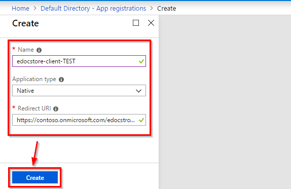  

2.	In the succeeding page, find the __Application ID__ value and copy it somewhere. It will be needed to acquire token from Azure AD.   
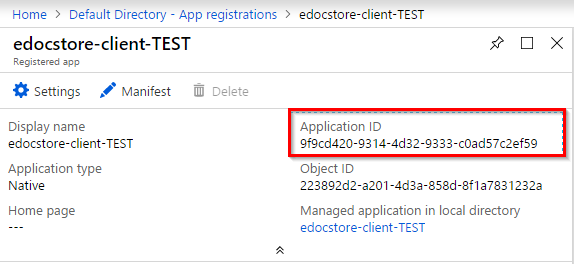  

3.	Configure Permissions for your application. In the __Settings__ menu, choose the '__Required permissions__' section and then, click on __Add__, then select an __API__.
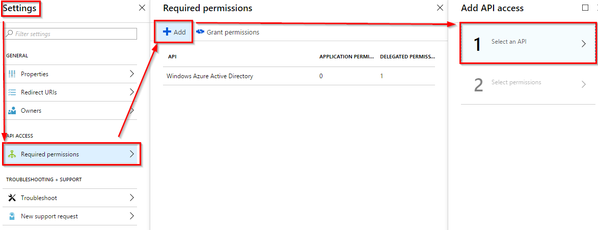  

 In the succeeding page type _eDocStore service binding Azure AD application name_ (e.g. ‘edocstore-services') in the textbox. 
  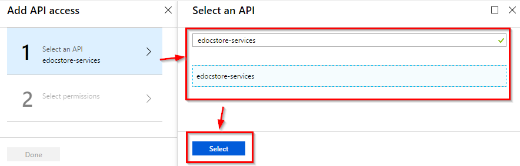  
 
 Then, click on __Select Permissions__ and select '__Access__ ... ' (_selected Azure Azure AD application name_) .  
 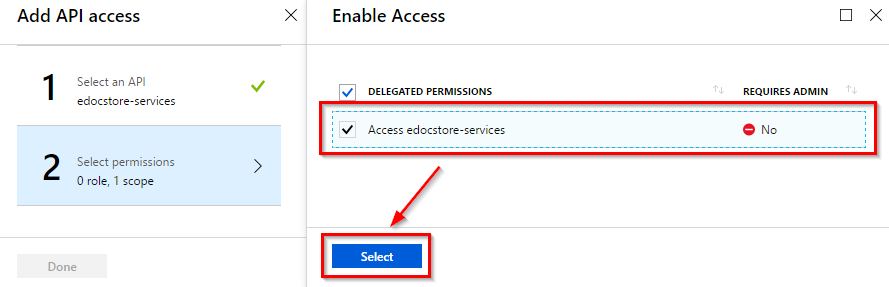  
 
 Then, click on __Done__.  
 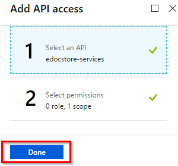  

__Web service binding client__

This section contains code sample of a request to the _eDocStore_ Web Server binding (_SOAP_) service. The aim of the request in this sample is to retrieve the root folder object for the _REP:100001_ repository. To successfully execute this request an authorized user should have assigned a role in _Azure AD_ ‘edocstore-services' _service principal_ which have permission to read properties in root folder’s _Access Control List_ (_ACL_), e.g '_Administrator_' role.

__NuGet packages__: 
```
Microsoft.IdentityModel.Clients.ActiveDirectory v3.19.8
```

__Sample code__:

```
class Program {
	static void Main(string[] args) {            
		ServicePointManager.SecurityProtocol = SecurityProtocolType.Tls12;
		ServiceReference1.ObjectServiceClient client = null;
		try {
			client = new ServiceReference1.ObjectServiceClient();

			// Attach bearer token authorization behavior  
			client.Endpoint.AddAuthorizationEndpointBehavior();

     	    var response = client.getObjectByPathAsync( 
			   repositoryId: "REP:100001",
			   path: "/",
			   includeACL: null,
			   includeAllowableActions: null,
			   includePolicyIds: null,
			   includeRelationships: null,
			   filter: null,
			   renditionFilter: null,
			   extension: null).Result;
				
			client.Close();
		}
		catch (Exception ex) {
			client?.Abort();
		}
	}
}

internal static class AzureAdToken {
	public static string Get() {
		// Azure AD tentant name
		string idaTenant = "contoso.onmicrosoft.com";

		// The base URL of the authorization server 
		// (this is always https://login.microsoftonline.com/{0}).
		string idaAadInstance = "https://login.microsoftonline.com/{0}"; 

		// Azure AD 'edocStore-client-TEST’ ApplicationID
		string idaClientId = "47458125-31f8-489b-9599-245ea26aa065";

		// Azure AD 'edocStore-client-TEST’ Redirect URI
		var idaRedirectUri = new Uri("https://contoso.onmicrosoft.com/edocStore-client-TEST");

		// App Id URI of the 'edocstore-services'
		string idaServiceResourceId = 
			"https://contoso.onmicrosoft.com/ae811c04-48c3-439e-9739-f4224ed43299";

		// The URL of the authorization server
		string idaAuthority = String.Format(CultureInfo.InvariantCulture, idaAadInstance, idaTenant);
		var ctx = new AuthenticationContext(idaAuthority);
		var token = ctx.AcquireTokenAsync(idaServiceResourceId, idaClientId, 
			idaRedirectUri, new PlatformParameters(PromptBehavior.Always)).Result;
			
		return token.AccessToken;
	}
}

internal class AuthorizationHeaderEndpointBehavior : IEndpointBehavior {
	public void ApplyClientBehavior(ServiceEndpoint endpoint, 
		System.ServiceModel.Dispatcher.ClientRuntime clientRuntime) {
		clientRuntime.ClientMessageInspectors.Add(new AuthorizationHeaderMessageInspector(AzureAdToken.Get()));
	}
	public void AddBindingParameters(ServiceEndpoint endpoint, 
		System.ServiceModel.Channels.BindingParameterCollection bindingParameters) {
	}

	public void ApplyDispatchBehavior(ServiceEndpoint endpoint, 
		System.ServiceModel.Dispatcher.EndpointDispatcher endpointDispatcher) {
	}

	public void Validate(ServiceEndpoint endpoint) {
	}
}

internal static class EndpointExtension {
	public static void AddAuthorizationEndpointBehavior(this ServiceEndpoint endpoint) {
		endpoint.EndpointBehaviors.Add(new AuthorizationHeaderEndpointBehavior());
	}
}

internal class AuthorizationHeaderMessageInspector : IClientMessageInspector {
	private readonly string _token;
	public AuthorizationHeaderMessageInspector(string token) {
		_token = string.Concat("Bearer ", string.IsNullOrEmpty(token)
			? AzureAdToken.Get() 
			: token);
	}

	public object BeforeSendRequest(ref System.ServiceModel.Channels.Message request, 
		System.ServiceModel.IClientChannel channel) {
		HttpRequestMessageProperty httpRequestMessage;
		object httpRequestMessageObject;
		if (request.Properties.TryGetValue(HttpRequestMessageProperty.Name,
			out httpRequestMessageObject)) {
			httpRequestMessage = httpRequestMessageObject as HttpRequestMessageProperty;
			if (string.IsNullOrEmpty(httpRequestMessage.Headers["Authorization"])) {
				httpRequestMessage.Headers["Authorization"] = _token;
			}
		}
		else {
			httpRequestMessage = new HttpRequestMessageProperty();
			httpRequestMessage.Headers.Add("Authorization", _token);
			request.Properties.Add(HttpRequestMessageProperty.Name, httpRequestMessage);
		}

		return null;
	}
	
		public void AfterReceiveReply(ref System.ServiceModel.Channels.Message reply, 
			object correlationState) {
	}
}
```

__Browser binding client__ 

This section contains a code sample of a request to the eDocStore Browser binding (_RESTful_) service. The aim of the request in this sample is to retrieve the root folder object for the _REP:100001_ repository. To successfully execute this request an authorized user should have assigned a role in _Azure AD_ ‘edocstore-services' _service principal_ which have permission to read properties in root folder’s _Access Control List_ (_ACL_), e.g '_Administrator_' role.

__NuGet packages__: 

```
Microsoft.IdentityModel.Clients.ActiveDirectory v3.19.8
```

__Sample code__:

```
private async Task GetRootFolder() {
    // Azure AD tentant name
    string idaTenant = "contoso.onmicrosoft.com";
    
    // The base URL of the authorization server 
	// (this is always https://login.microsoftonline.com/{0}).
    string idaAadInstance = "https://login.microsoftonline.com/{0}";

    // Azure AD 'edocStore-client-TEST’ ApplicationID
    string idaClientId = "47458125-31f8-489b-9599-245ea26aa065";       

    // Azure AD 'edocStore-client-TEST’ Redirect URI
    Uri idaRedirectUri = new Uri("https://contoso.onmicrosoft.com/edocStore-client-TEST");
    
    // App Id URI of the 'edocstore-services'
    string IdaServiceResourceId = 
	"https://contoso.onmicrosoft.com/ae811c04-48c3-439e-9739-f4224ed43299";

    // eDocStore base URL to retrieve ROOT folder of the REP:100001 repository.
    string eDocStoreRootFolderAddress = 
	"https://edocstoreresta936c965dda.azurewebsites.net/cmis/REP:100001/root";

    // The URL of the authorization server
    string IdaAuthority = String.Format(CultureInfo.InvariantCulture, idaAadInstance, idaTenant);

    // Get an access token to call the eDocStore CMIS service.
    var authContext = new AuthenticationContext(IdaAuthority);            
	authContext.TokenCache.Clear();

    AuthenticationResult result = null;
    try {
        result = await authContext.AcquireTokenAsync(IdaServiceResourceId, idaClientId, 
			idaRedirectUri, new PlatformParameters(PromptBehavior.Always));
    }
    catch (AdalException ex) {
        // An unexpected error occurred.
        string message = ex.Message;
        if (ex.InnerException != null) {
            message += 
			"Error Code: " + ex.ErrorCode + "Inner Exception : " + ex.InnerException.Message;
        }

        Console.WriteLine(message);
        return;
    }

    // Once the token has been returned by ADAL, 
	// add it to the http authorization header as a bearer token,
	// before making the call to access the eDocStore service.
    httpClient.DefaultRequestHeaders.Authorization = new AuthenticationHeaderValue("Bearer",
		result.AccessToken);

    HttpResponseMessage response = await httpClient.GetAsync(eDocStoreRootFolderAddress);

    if (response.IsSuccessStatusCode) {
        Console.WriteLine("An error occurred : " + response.ReasonPhrase);
    }
 
    string s = await response.Content.ReadAsStringAsync();
    Console.WriteLine("Response : " + s);
}
```

## See also
- [Architecture overview](edocstore-azure-architecture-overview.md)
- [eDocStore overview](welcome.md)
- [Samples](edocstore-azure-samples.md)
- [User guide](edocstore-azure-user-guide.md)
