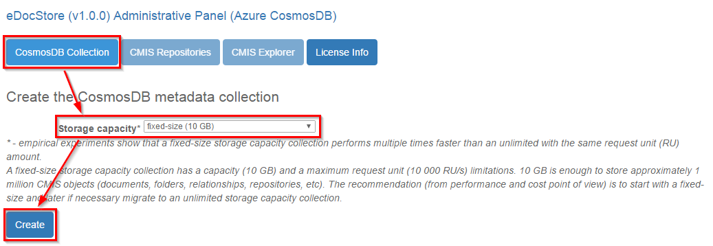
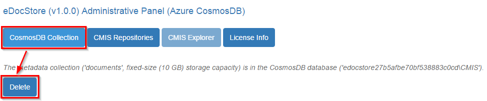
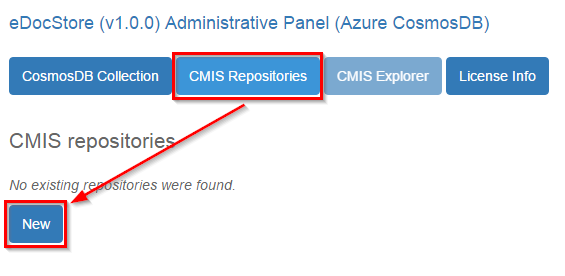
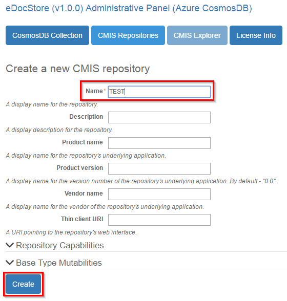
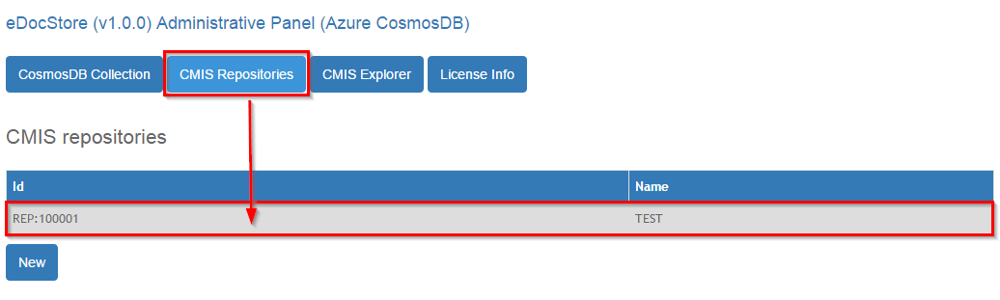
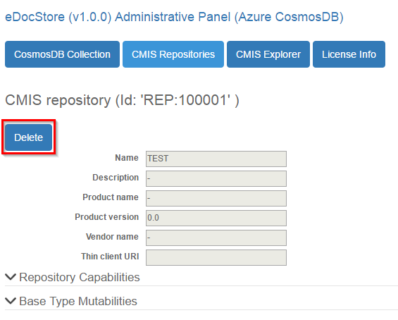
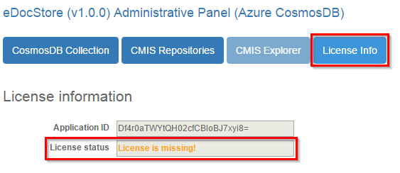
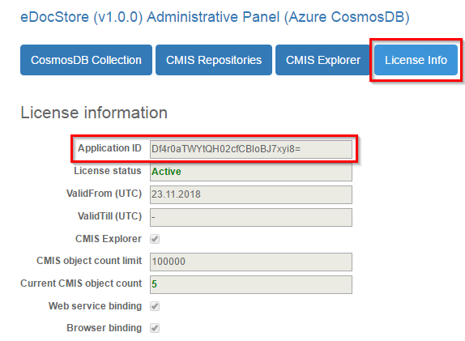
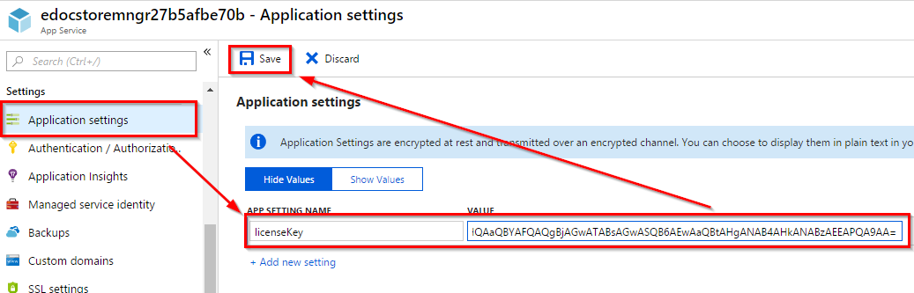
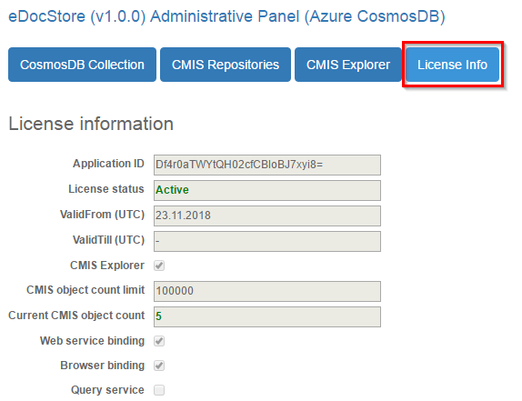

<!--
---
title: "eDocStore Azure User guide"
description: eDocStore Azure User guide.
date: 09/11/2018
---
-->
# User guide 

This user guide contains step by step instructions of how to:

* [create and delete an eDocStore CosmosDB collection](#creation-and-deletion-of-an-edocstore-cosmosdb-collection);
* [create and delete an eDocStore CMIS repository](#creation-and-deletion-of-an-edocstore-cmis-repository);
* [request and set up an eDocStore license](#request-and-installation-of-an-edocstore-license).

## Creation and deletion of an eDocStore CosmosDB collection

To successfully use the eDocStore solution, an existing CosmosDB collection is required. If the CosmosDB collection is not created, then neither is possible to [create a CMIS repository](#creation-and-deletion-of-an-edocstore-cmis-repository) nor use the CMIS Explorer. The eDocStore solution can use only a single CosmosDB collection.   
This section contains step by step instructions of how to create and delete an eDocStore ComsosDB collection from __Administrative Panel__.

To create an eDocStore ComsosDB collection: 
1. go to the __CosmosDB collection__ page in __Administrative Panel__;
2. select __storage capacity__ for the ComsosDB collection and click on __Create__. 

__NB!__ it is recommended to use a fixed-size collection while __10 GB__ capacity is enough.

  

It is possible to delete an existing eDocStore CosmosDB collection from __Administrative Panel__. On a collection delete all it's contained CMIS repositories, their content and related binary content are __irreversible__ deleted.    
To delete an eDocStore ComsosDB collection: 
1. go to the __CosmosDB collection__ page in __Administrative Panel__;
2. click on __Delete__ and in the succeeding page click on __OK__ to confirm deletion.

  

## Creation and deletion of an eDocStore CMIS repository

To successfully use the eDocStore solution at least a single existing CMIS repository is required. eDocStore supports multiple CMIS repositories and it is recommended to create separate repository for each use case. It is possible to create repositories with different behaviours to meet specific requirements of each individual use case.  
This section contains step by step instructions of how to create and delete an eDocStore CMIS repository from __Administrative Panel__.

To create an eDocStore CMIS repository:
0. it is required to have an existing eDocStore ComsosDB collection (see [creation and deletion an eDocStore CosmosDB collection](#creation-and-deletion-of-an-edocstore-cosmosdb-collection));
1. go to the __CMIS repositories__ page in __Administrative Panel__;
2. click on __New__;  

  
3. in the succeeding page fill required fields and make other necessary CMIS repository adjustments based on it's planned use case and click on __Create__.

  

It is possible to delete an existing eDocStore CMIS repository from __Administrative Panel__. On the repository delete all it's CMIS objects and related binary content are __irreversible__ deleted.   
To delete an eDocStore CMIS repository:
1. go to the __CMIS repositories__ page in __Administrative Panel__;
2. select the desired repository from the list;

  

3. in the succeeding page click on __Delete__ and in the succeeding page click on __OK__ to confirm deletion.

  

## Request and installation of an eDocStore license 

To successfully use the eDocStore solution, a license is required. 
If the license is not set 
+ for the Administrative Panel, then the __License status__ will be _"license is missing"_ in the license information page in __Administrative Panel__.   
   
+ for API service applications, then an exception will be thrown on any request.

The license may be either temporary (trial) or permanent (may be fixed-term) license. In either case, the license is issued for the individual eDocStore instance which is identified by it's __Application ID__. 

Currently only a __Basic__ license is available. The __Basic__ license is a permanent type license with an unlimited usage term but with some functional and usage limitations. 

To get a license, a [license request](#a-license-request) has to be made.

Once the license is received, it has to be installed (see [a license installation](#a-license-installation) to each desired eDocStore application (API services, Administrative Panel) separately.

### A license request

Currently a license request can be made by sending an email to abcsoftware@abcsoftware.lv with an eDocStore __Application ID__ included. The __Application ID__ can be found in the license information page in __Administrative Panel__: 

  

### A license installation
This section contains step by step instructions of how to install a license for the specific eDocStore application (API services or Administrative Panel).

1. In the __App Service__ pane select specific eDocStore application __App Service__.  
2. Click on __Application settings__ and set '__licenseKey__' property value to received __License Key__ string.   
    

A license can be verified in license information page in __Administrative Panel__ by inspecting __License status__.
  

 ## See also
- [Samples](edocstore-azure-samples.md)
- [Installation guide](edocstore-azure-installation-guide.md)
- [Architecture overview](edocstore-azure-architecture-overview.md)
- [eDocStore overview](welcome.md)
