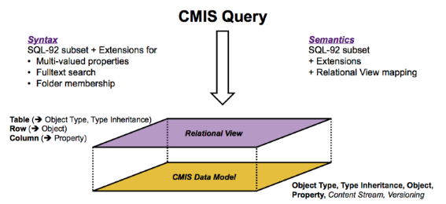

<!--
---
title: Welcome to eDocStore
description: Getting started with eDocStore.
author: alvis
date: 09/11/2018
---
-->
# Welcome to eDocStore

The eDocStore is a centralized, scalable, structured content storage solution with Enterprise Content Management (ECM) grade interoperability abilities based on open OASIS standard [Content Management Interoperability Services (CMIS) v1.1](http://docs.oasis-open.org/cmis/CMIS/v1.1/CMIS-v1.1.html).  

## Use cases and benefits
Typical use case includes centralized, typed, structured and secure document storage in a distributed architecture (e.g. microservices) environments where a document can be any size and any type of file (.pdf, .docx, .png etc.). 
The benefits of adoption of the eDocStore solution in such a architecture designs includes:
* prevention of duplicate document creation, storage;
* reduction of data transfers; 
* reduction of overall complexity of components which are involved in document creation or usage;
* standardized, platform independent interoperability;
* increased document content security;
* increased ability to get more value out of the data.

## Platforms

This section contains all platform specific implementations of the eDocStore solution.  

- [eDocStore on Microsoft Azure](edocstore-azure.md)

## CMIS implementation
eDocStore implementation of the [CMIS standard v1.1](http://docs.oasis-open.org/cmis/CMIS/v1.1/CMIS-v1.1.html) includes: 
* CMIS Web Service (SOAP, XML) binding API based on [errata01](http://docs.oasis-open.org/cmis/CMIS/v1.1/errata01/os/schema/);
* CMIS Browser (JSON, REST) binding  API __(preview)__.

Implemented CMIS v1.1 services and implementation specific:
*	__Repository Services__ – can be used to discover information about the repository, including information about the repository and the object-types defined for the repository. Furthermore, it provides operations to create, modify and delete object-type definitions if that is supported by the repository:
	*   __getRepositories__ – returns a list of CMIS repositories;
	*	__getRepositoryInfo__ – returns information about the CMIS repository, the optional capabilities it supports and it's access control information if applicable;
	*	__getTypeChildren__ –  returns the list of object-types defined for the repository that are children of the specified type;
	*	__getTypeDefinition__ –  returns the definition of the specified object-type;
	*	__createType__ – creates a new type definition that is a subtype of an existing specified parent type;
	*	__updateType__ – updates a type definition;
	*	__deleteType__ – deletes a type definition.

	
*	__Navigation Services__ – can be used to traverse the folder hierarchy in a CMIS repository, and to locate documents that are checked out:
	*	__getChildren__ – gets the list of child objects contained in the specified folder;
	*	__getDescendants__ – gets the set of descendant objects contained in the specified folder or any of it's child-folders;
	*	__getFolderTree__ – gets the set of descendant folder objects contained in the specified folder;
	*	__getFolderParent__ – gets the parent folder object for the specified folder object;
	*	__getObjectParents__ – gets the parent folder(s) for the specified fileable object.

	
*	__Object Services__ – can be used to provide id-based CRUD (Create, Retrieve, Update, Delete) operations on objects in a repository:
	*	__createDocument__ – creates a document object of the specified type in the specified location;
	*	__createDocumentFromSource__ – creates a document object as a copy of the given source document in the specified location;
	*	__createFolder__ – creates a folder object of the specified type in the specified location;
	*	__createRelationship__ – creates a relationship object of the specified type;
	*	__getAllowableActions__ – gets the list of allowable actions for an object;
	*	__getProperties__ – gets the list of properties for the object;
	*	__getObject__ – gets the specified information (properties) for the object by it’s identifcator;
	*	__getObjectByPath__ – gets the specified information (properties) for the object by it’s cmis:path;
	*	__getContentStream__ – gets the content stream for the specified document object;
	*	__updateProperties__ – updates properties of the specified object;
	*	__bulkUpdateProperties__ – updates properties of one or more objects;
	*	__moveObject__ – moves the specified file-able object from one folder to another;
	*	__deleteObject__ – deletes the specified object;
	*	__deleteTree__ – deletes the specified folder object and all of it's child- and descendant-objects;
	*	__setContentStream__ – sets the content stream for the specified document object;
	*	__deleteContentStream__ – deletes the content stream for the specified document object;
	*	__appendContentStream__ – appends to the content stream for the specified document object.

	
*	__Multi-filing Services__ – can be used to file/un-file objects into/from folders:
	*	__addObjectToFolder__ – adds an existing fileable non-folder object to a folder;
	*	__removeObjectFromFolder__ – removes an existing fileable non-folder object from a folder.

	
*	__Versioning Services__ – can be used to navigate or update a document version series:
	*	__getPropertiesOfLatestVersion__ – gets a subset of the properties for the latest document object in the version series;
	*	__getObjectOfLatestVersion__ – get the latest document object properties in the version series;
	*	__getAllVersions__ – returns the list of all document objects in the specified version series, sorted by cmis:creationDate descending.

	
*	__Relationship Services__ – can be used to retrieve the dependent relationship objects associated with an independent object:
	*	__getObjectRelationships__ – gets all or a subset of relationships associated with an independent object.

	
*	__ACL Services__ – can be used to discover and manage Access Control Lists (ACLs):
	*	__applyACL__ – adds or removes the given Access Control Entries (ACEs) to or from the ACL of an object;
	*	__getACL__ – gets the ACL currently applied to the specified object.

	
*	__Discovery Services__ – can be used to search for query-able objects within the repository:
	*	__query__ – executes a CMIS query statement against the content of the repository.  
	  
	  
	__Supported CMIS Query sintax__  
	```
	<CMIS 1.1 query statement> ::= <simple table> [ <order by clause> ]  
	<simple table>   ::= SELECT <select list> <from clause> [ <where clause> ]  
	<order by clause> ::= ORDER BY <sort specification> [ { "," <sort specification> }... ]   
	<sort specification> ::= <column reference> [ ASC | DESC ]    
	```
